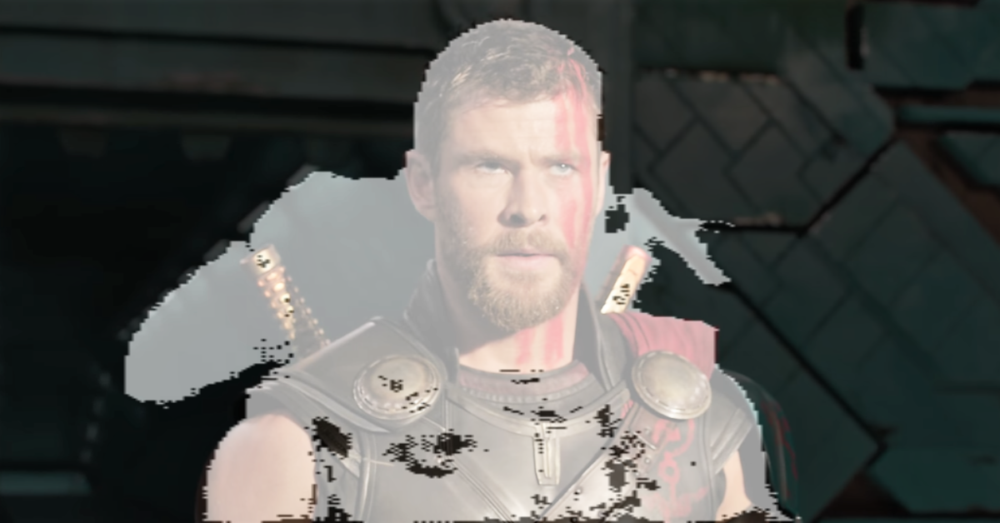
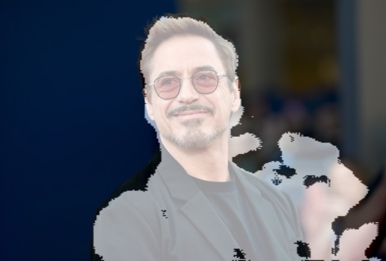

# Unet for Person Segmentation
We are using the famous UNet architecture for segmenting person from an image. For the person segmentation, we are going to use the person segmentation dataset. U-Net is built for Biomedical Image Segmentation. It is the base model for any segmentation task. It follows an encoder-decoder approach. It used skip connection to get the local information during downsampling path and use it during the upsampling path. 

YouTube Video: [https://youtu.be/qrL22HEaUGA](https://youtu.be/qrL22HEaUGA)  
Arxiv Paper: [U-Net: Convolutional Networks for Biomedical Image Segmentation](https://arxiv.org/abs/1505.04597])

These images are generated after the model is trained on 2 epochs.

